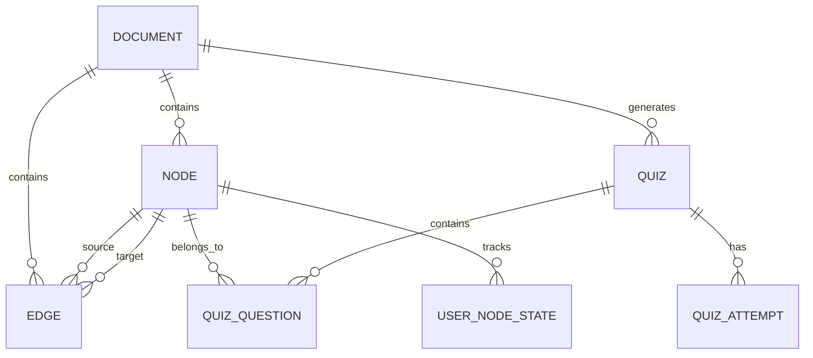

# Database Schema

## Entity Relationship Diagram

## Table Specifications

### documents
| Column | Type | Constraints | Default |
|--------|------|-------------|---------|
| id | UUID (PK) | NOT NULL | gen_random_uuid() |
| title | TEXT | NOT NULL | '' |
| source_path | TEXT | NOT NULL | '' |
| raw_text | TEXT | | NULL |
| status | TEXT | NOT NULL | 'pending' |
| error_msg | TEXT | | NULL |
| created_at | DATETIME | NOT NULL | now() |
| updated_at | DATETIME | NOT NULL | now() |

**Indexes:** documents.status
**Status enum:** pending → reading → parsing → analyzing → graph_building → quiz_generating → completed | failed

### nodes
| Column | Type | Constraints | Default |
|--------|------|-------------|---------|
| id | UUID (PK) | NOT NULL | gen_random_uuid() |
| document_id | UUID (FK → documents.id) | NOT NULL, ON DELETE CASCADE | |
| label | TEXT | NOT NULL | '' |
| summary | TEXT | NOT NULL, max 500 chars | '' |
| full_text | TEXT | NOT NULL | '' |
| position_x | FLOAT | | NULL |
| position_y | FLOAT | | NULL |
| color | TEXT | NOT NULL | '#4ECDC4' |
| weight | FLOAT | NOT NULL | 0.0 |
| theme_category | TEXT | | NULL |
| created_at | DATETIME | NOT NULL | now() |

**Indexes:** nodes.document_id

### edges
| Column | Type | Constraints | Default |
|--------|------|-------------|---------|
| id | UUID (PK) | NOT NULL | gen_random_uuid() |
| source_node_id | UUID (FK → nodes.id) | NOT NULL, ON DELETE CASCADE | |
| target_node_id | UUID (FK → nodes.id) | NOT NULL, ON DELETE CASCADE | |
| document_id | UUID (FK → documents.id) | NOT NULL, ON DELETE CASCADE | |
| relation_type | TEXT | | NULL |
| strength | FLOAT | NOT NULL | 0.0 |
| created_at | DATETIME | NOT NULL | now() |

**Indexes:** edges.document_id, edges.source_node_id, edges.target_node_id

### quizzes
| Column | Type | Constraints | Default |
|--------|------|-------------|---------|
| id | UUID (PK) | NOT NULL | gen_random_uuid() |
| document_id | UUID (FK → documents.id) | NOT NULL, ON DELETE CASCADE | |
| node_id | UUID (FK → nodes.id) | ON DELETE SET NULL | NULL |
| total_questions | INT | NOT NULL | 0 |
| created_at | DATETIME | NOT NULL | now() |

**Indexes:** quizzes.document_id

### quiz_questions
| Column | Type | Constraints | Default |
|--------|------|-------------|---------|
| id | UUID (PK) | NOT NULL | gen_random_uuid() |
| quiz_id | UUID (FK → quizzes.id) | NOT NULL, ON DELETE CASCADE | |
| question_text | TEXT | NOT NULL | '' |
| options_json | TEXT | NOT NULL | '[]' |
| correct_index | INT | NOT NULL | 0 |
| explanation | TEXT | | NULL |

**Indexes:** quiz_questions.quiz_id

### quiz_attempts
| Column | Type | Constraints | Default |
|--------|------|-------------|---------|
| id | UUID (PK) | NOT NULL | gen_random_uuid() |
| quiz_id | UUID (FK → quizzes.id) | NOT NULL, ON DELETE CASCADE | |
| score | INT | NOT NULL | 0 |
| total | INT | NOT NULL | 0 |
| answers_json | TEXT | NOT NULL | '{}' |
| completed_at | DATETIME | NOT NULL | now() |

**Indexes:** quiz_attempts.quiz_id

### user_node_states
| Column | Type | Constraints | Default |
|--------|------|-------------|---------|
| id | UUID (PK) | NOT NULL | gen_random_uuid() |
| node_id | UUID (FK → nodes.id) | NOT NULL, ON DELETE CASCADE | |
| state | TEXT | NOT NULL | 'new' |
| last_reviewed | DATE | | NULL |
| review_count | INT | NOT NULL | 0 |
| created_at | DATETIME | NOT NULL | now() |

**Indexes:** user_node_states.node_id
**State enum:** new → reviewing → learned

### scores
| Column | Type | Constraints | Default |
|--------|------|-------------|---------|
| id | UUID (PK) | NOT NULL | gen_random_uuid() |
| document_id | UUID (FK → documents.id) | NOT NULL, ON DELETE CASCADE | |
| quiz_id | UUID (FK → quizzes.id) | NOT NULL, ON DELETE CASCADE | |
| correct_count | INT | NOT NULL | 0 |
| total_count | INT | NOT NULL | 0 |
| timestamp | DATETIME | NOT NULL | now() |

**Indexes:** scores.document_id, scores.quiz_id

## Naming Conventions
- All tables: lowercase snake_case, plural
- All columns: lowercase snake_case
- All FKs: ON DELETE CASCADE (or SET NULL where noted)
- All timestamps: created_at, updated_at (never `date`)
- No soft deletes — hard delete with cascade
- UUID primary keys for all entities
